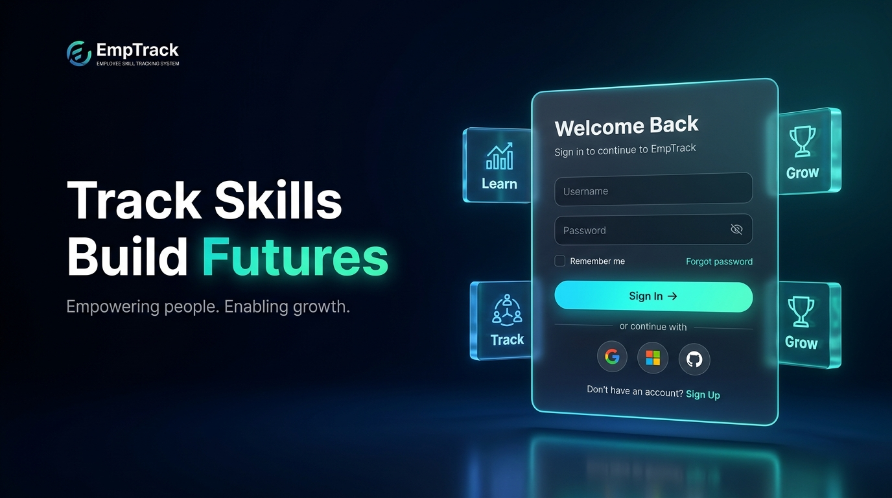

# 🧭 EmpTrack — Employee Skill Tracking System (Skill Compass)

<div align="center">



**Track Skills. Build Futures. Empowering people. Enabling growth.**

[](https://php.net)
[](https://mysql.com)
[](#-security--csrf-protection)
[](#-futuristic-3d-ui--login-experience)
[](LICENSE)

</div>

---

## 📖 Overview

**EmpTrack (Skill Compass)** is an enterprise-grade workforce skill tracking, verification, and training management platform. Designed for organizations seeking data-driven talent development, it unifies self-service employee skill requests, manager review workflows, certification compliance verification, and executive organizational audit reporting into a high-performance web architecture.

---

## ✨ Key Capabilities & Features

### 🌟 Futuristic 3D UI & Login Experience
- **Cinematic Dark Corporate Environment:** Deep navy/obsidian background with cyan, cobalt, and emerald volumetric ambient glows.
- **3D Perspective Tilt:** Interactive mouse-parallax glass card powered by CSS3 3D transforms (`perspective`, `rotateX`, `rotateY`).
- **Floating 3D Blocks:** Holographic acrylic blocks representing **Learn** (Analytics), **Track** (Workforce), and **Grow** (Achievements) with floating micro-animations.
- **Modern Authentication:** Toggleable password visibility, remember me, enterprise SSO links (Google, Microsoft 365, GitHub), and **1-click quick demo login buttons**.

### 🔄 Self-Service Requests & Automated Approval Engine
- **Employee Request Portal:** Employees submit:
  - 💡 **Skill Endorsements:** Specify proficiency (10–100%) and evidence notes.
  - 📜 **Certifications:** Submit credential details with uploaded document proof (PDF/PNG/JPG).
  - 🎓 **Training Enrollments:** Enroll in active cohorts or suggest new topics.
- **Manager & HR Approval Queue:** Real-time review queue with reviewer feedback notes and 1-click **Approve** or **Reject** actions.
- **Automated Fulfillment:** On approval, verified skills, certifications, and trainings are automatically injected into core database tables (`employee_skills`, `certifications`, `trainings`).

### 🛡️ Security & Zero-Trust CSRF Protection
- **Centralized CSRF Helper (`php/csrf.php`):** Cryptographically secure token generation (`bin2hex(random_bytes(32))`), validation with timing-attack-safe `hash_equals()`, and automated guard `require_csrf()`.
- **Form Hardening:** Active on all forms across the application (authentication, profile updates, skill endorsements, certificate uploads, manager reviews).
- **Password Security:** Multi-factor password change verification requiring current password validation and secure Bcrypt hashing (`PASSWORD_DEFAULT`).

### 📁 Document Uploads & Verification Engine
- **Dedicated Upload Architecture (`php/upload_helper.php`):**
  - Whitelist validation for `.pdf`, `.png`, `.jpg`, and `.jpeg`.
  - Deep MIME-type verification using PHP `finfo` to prevent extension spoofing.
  - Enforced 5MB size limit.
  - Collision-free, cryptographically randomized filenames (`cert_[16 hex]_[timestamp].[ext]`).
- **Reviewer Inspection:** Managers can inspect uploaded documents directly in the approval queue prior to approving.

### 📊 Universal Streaming CSV Data Exports
- **Memory-Efficient Streaming (`php/export.php`):** Direct output streaming (`php://output`) handling large enterprise datasets.
- **Excel UTF-8 Compatibility:** Automatically prepends the UTF-8 Byte Order Mark (`\xEF\xBB\xBF`) for character fidelity in Microsoft Excel.
- **6 Universal Export Types:**
  1. `employees`: Complete employee directory with verified skills count and active trainings.
  2. `skills`: Organizational skill catalog with distribution and average proficiency.
  3. `certifications`: Compliance audit with expiration dates and verification URLs/documents.
  4. `trainings`: Schedule report with attendance status and completion timeline.
  5. `reports`: Full comprehensive audit with department benchmarks and complete skill matrix.
  6. `employee_skills`: Per-employee skills portfolio and proficiency breakdown.

---

## 👥 Roles & Test Accounts

| Role | Username | Password | Permissions & Dashboard Scope |
| :--- | :--- | :--- | :--- |
| **System Administrator** | `admin` | `admin123` | Full enterprise control, skill catalog management, audit reports, user accounts, system configuration |
| **HR Manager** | `hrmanager` | `hr123` | Employee management, training scheduling, organizational analytics, CSV reporting |
| **Team Manager** | `rjohnson` | `manager123` | Team approvals queue, endorsement reviews, skill assessment, department training assignments |
| **Employee** | `jdoe` | `employee123` | Self-service portal, request submission, skills tracking, certificate upload, training view |

*Additional employee test accounts (Password: `employee123`): `jsmith`, `mwilson`, `lbrown`.*

---

## 🛠️ Technology Stack

- **Backend:** PHP 8.2+ / PHP 8.3 (Object-Oriented, PDO/MySQLi, Session Authentication)
- **Database:** MySQL 8.0+ / MariaDB (`skill_compass` schema)
- **Frontend:** Vanilla HTML5, Modern CSS3 (3D Transforms, Custom Properties, Glassmorphism), ES6+ JavaScript
- **Icons & Typography:** Font Awesome 6, Google Fonts (*Outfit*, *Inter*, *Roboto*)
- **Security:** CSRF Tokens, Bcrypt Password Hashing, Prepared Statements, Strict File Mime Validation

---

## 🚀 Quick Start & Installation

### 1. Clone the Repository
```bash
git clone https://github.com/SREEJITHGI/emp-skill-compass.git
cd emp-skill-compass
```

### 2. Configure the Database
1. Open MySQL and create the database:
   ```sql
   CREATE DATABASE skill_compass CHARACTER SET utf8mb4 COLLATE utf8mb4_unicode_ci;
   ```
2. Import the schema and seed data:
   ```bash
   mysql -u root -p skill_compass < skill_compass.sql
   ```
3. Update your credentials in [php/config.php](php/config.php):
   ```php
   define('DB_SERVER', 'localhost');
   define('DB_USERNAME', 'root');
   define('DB_PASSWORD', 'your_password');
   define('DB_NAME', 'skill_compass');
   ```
4. Run the automated database setup to hash default passwords and apply migrations:
   ```bash
   php setup_database.php
   php php/migrate_requests.php
   ```

### 3. Launch the Application
Run via the included Windows launcher:
```cmd
start_app.bat
```
Or start PHP's built-in server directly:
```bash
php -S localhost:8080
```
Open **[http://localhost:8080/index.php](http://localhost:8080/index.php)** in your web browser.

---

## 🧪 Automated Testing

The project includes an automated test suite verifying security, workflows, and exports:

```bash
# Test 1: Self-Service Requests & Manager Approval Workflow
php tests/test_requests_flow.php

# Test 2: Profile Updates, Password Changes & CSRF Protection
php tests/test_profile_csrf.php

# Test 3: Certificate Upload Validator & Universal CSV Exports
php tests/test_upload_and_export.php
```

---

## 📁 Project Structure

```text
├── css/
│   └── style.css                   # Core design tokens and dashboard styling
├── img/
│   ├── emptrack_3d_bg.jpg          # 3D cinematic rendering visual asset
│   └── login-bg.jpg                # Background image fallback
├── php/
│   ├── auth.php                    # Authentication controller & session handling
│   ├── config.php                  # Database connection parameters
│   ├── csrf.php                    # Centralized CSRF token generator & guard
│   ├── export.php                  # Universal streaming CSV export controller
│   ├── handle_request.php          # Request submission & approval fulfillment engine
│   ├── migrate_requests.php        # Database schema migration for requests
│   └── upload_helper.php           # Secure file upload validator
├── tests/
│   ├── test_profile_csrf.php       # Automated security & profile test suite
│   ├── test_requests_flow.php      # Automated request/approval workflow test suite
│   └── test_upload_and_export.php  # Automated upload validator & CSV export tests
├── uploads/
│   └── certificates/               # Protected certificate storage directory
├── index.php                       # Futuristic 3D EmpTrack login experience
├── dashboard.php                   # Executive & Administrator dashboard
├── manager_dashboard.php           # Team Manager review & approval queue
├── employee_dashboard.php          # Employee self-service portal
├── profile.php                     # User profile settings & password change
├── employees.php                   # Directory of organizational employees
├── skills.php                      # Enterprise skill catalog & proficiency benchmarks
├── certifications.php              # Certification records & document attachments
├── trainings.php                   # Training schedule & cohort management
├── reports.php                     # Analytics, skill matrices & completion charts
├── setup_database.php              # Database seed & password initializer
├── skill_compass.sql               # Complete SQL schema and seed data
└── start_app.bat                   # 1-click application launcher
```

---

## 📄 License

This project is licensed under the [MIT License](LICENSE).
